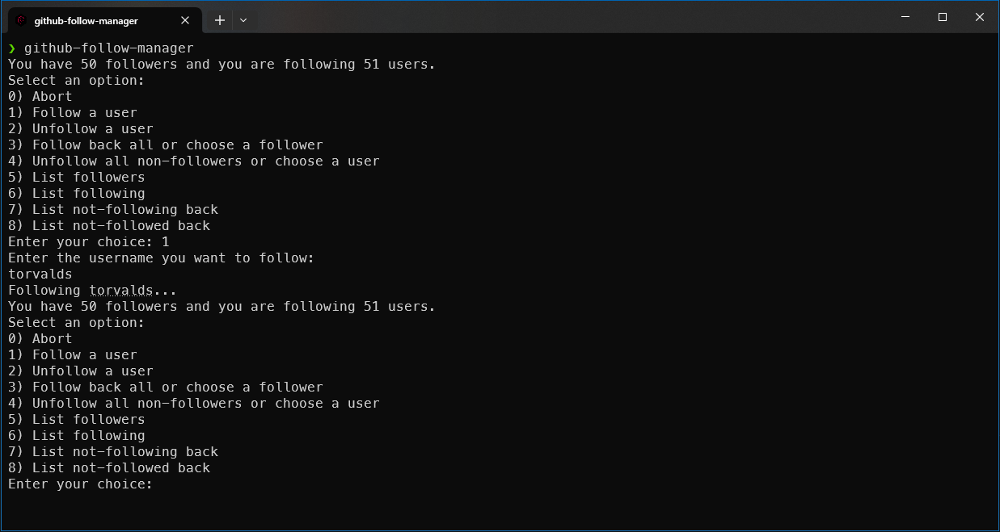

# Github Follow Manager

[](https://github.com/milosz275/github-follow-manager/actions/workflows/deploy.yml)
[](/LICENSE)



This is a simple utility to help you manage your GitHub followers efficiently. With [Github Follow Manager](https://github.com/milosz275/github-follow-manager), you can easily follow back all your followers with a single command and unfollow users who aren't following you back. The script is written in shell scripting language and uses the GitHub API to interact with your followers and following list.

## Features

- Follow Back: Automatically follow all users who are currently following you.
- Unfollow Non-Followers: Unfollow all users who are not following you back, helping you maintain a tidy followers list.
- Ease of Use: Simple command-line interface with minimal setup required.
- Lightweight: A small, fast script written in shell scripting language, using curl and jq for interacting with the GitHub API.

## Prerequisites

### Dependencies

Before using Github Follow Manager, ensure you have the following installed:

- Bash: The script is written for Bash and should be run in a Unix-like environment.
- curl: Used for making HTTP requests to the GitHub API.
- jq: A lightweight and flexible command-line JSON processor, used for parsing API responses.

Install `curl` and `jq` on your system using the following commands:

On Ubuntu/Debian:

```bash
sudo apt-get install curl jq
```

On RedHat/CentOS:

```bash
sudo yum install curl jq
```

### Personal Access Token

Before using the script, you need to set your GitHub username and personal access token. You can generate a personal access token from your GitHub account settings under "Developer settings" -> "Personal access tokens". The token should have the `read:user` and `user:follow` scope enabled.

## Installation

> [!NOTE]
> Default installation directory is `/usr/local/bin`

To install [Github Follow Manager](https://github.com/milosz275/github-follow-manager), simply run the following command in your terminal:

```bash
curl -s https://raw.githubusercontent.com/milosz275/github-follow-manager/main/install.sh | sudo bash
```

## Uninstallation

To uninstall [Github Follow Manager](https://github.com/milosz275/github-follow-manager), simply run the following command in your terminal:

```bash
curl -s https://raw.githubusercontent.com/milosz275/github-follow-manager/main/uninstall.sh | sudo bash -s -- -y
```

## Usage

The script provides several arguments to manage your GitHub followers. You can run the script by simply running:

```bash
github-follow-manager [argument]
```

Arguments:

- `help`: Display the help message with a list of available arguments.
- `follow`: Follow a user by providing their username.
- `unfollow`: Unfollow a user by providing their username.
- `follow-back`: Follow back all users who are following you.
- `unfollow-non-followers`: Unfollow users who are not following you back.
- `list-followers`: List all users who are following you.
- `list-following`: List all users you are following.
- `list-not-following-back`: List all users who are not following you back.

## Acknowledgements

- [Bannerbear](https://www.bannerbear.com/) for generating the logo image.

## License

This project is licensed under the MIT License - see the [LICENSE](LICENSE) file for details.
